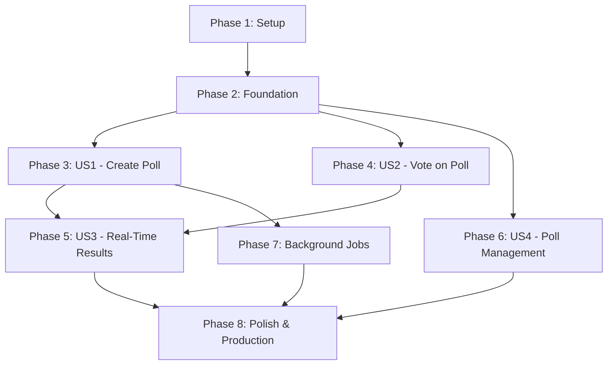

# Tasks: Poll Voting System

**Input**: Design documents from `/specs/001-poll-voting-system/`  
**Prerequisites**: [plan.md](plan.md), [spec.md](spec.md)  
**Feature Branch**: `001-poll-voting-system`

## Format: `- [ ] [ID] [P?] [Story] Description`

- **[P]**: Can run in parallel (different files, no dependencies)
- **[Story]**: Which user story this task belongs to (US1, US2, US3, US4)
- Paths use Rails conventions: `app/models/`, `app/controllers/`, `app/views/`, `test/`

---

## Phase 1: Setup (Shared Infrastructure)

**Purpose**: Project initialization and Rails application structure

- [ ] T001 Create feature branch `001-poll-voting-system` from `develop`
- [ ] T002 Verify Rails 8.1.2 with Ruby 4.0.1 and PostgreSQL 15+ installed
- [ ] T003 [P] Configure Tailwind CSS 4+ and verify Stimulus controllers load
- [ ] T004 [P] Verify Solid Queue, Solid Cache, Solid Cable are configured in `config/database.yml`

---

## Phase 2: Foundational (Blocking Prerequisites)

**Purpose**: Database schema and base models that ALL user stories depend on

**⚠️ CRITICAL**: No user story work can begin until this phase is complete

- [ ] T005 Generate migration `CreatePolls` with columns: question:string, deadline:datetime, access_code:string, show_results_while_voting:boolean, status:string, total_votes:integer
- [ ] T006 [P] Generate migration `CreateChoices` with columns: poll_id:references, text:string, position:integer, votes_count:integer
- [ ] T007 [P] Generate migration `CreateVotes` with columns: poll_id:references, choice_id:references, participant_fingerprint:string, ip_hash:string, session_token:string, voted_at:datetime
- [ ] T008 Add database indexes: access_code (unique), poll_id+participant_fingerprint (composite unique), status, deadline
- [ ] T009 Run `rails db:migrate` and verify schema.rb reflects all tables
- [ ] T010 [P] Create `app/models/poll.rb` with associations: `has_many :choices`, `has_many :votes, through: :choices`
- [ ] T011 [P] Create `app/models/choice.rb` with associations: `belongs_to :poll`, `has_many :votes`, counter_cache: votes_count
- [ ] T012 [P] Create `app/models/vote.rb` with associations: `belongs_to :poll`, `belongs_to :choice`, validates uniqueness: participant_fingerprint scoped to poll_id
- [ ] T013 Add Poll validations in `app/models/poll.rb`: presence of question, deadline; custom validation deadline_must_be_in_future on create
- [ ] T014 [P] Add Choice validations in `app/models/choice.rb`: presence of text, poll_id; length maximum 200
- [ ] T015 [P] Add Vote validations in `app/models/vote.rb`: presence of poll_id, choice_id, participant_fingerprint; custom validation poll_must_be_active
- [ ] T016 Implement `before_create :generate_access_code` in Poll model using `SecureRandom.urlsafe_base64(6).upcase[0..7]`
- [ ] T017 [P] Implement Poll instance methods: `active?`, `closed?`, `close!` in `app/models/poll.rb`
- [ ] T018 Configure routes in `config/routes.rb`: `resources :polls, param: :access_code` with nested `resources :votes`

**Checkpoint**: Foundation ready - database schema exists, models validated, routes configured

---

## Phase 3: User Story 1 - Poll Creator Creates and Publishes Poll (Priority: P1) 🎯 MVP

**Goal**: Poll creator can create poll with question, ≥2 choices, future deadline, and receive shareable link

**Independent Test**: Create poll with question "What's your favorite color?", choices ["Red", "Blue", "Green"], deadline "February 15, 2026 5:00 PM", click "Create Poll", verify shareable link displayed like `/polls/ABC12345`

### Tests for User Story 1 (TDD - Write First, Ensure FAIL)

- [X] T019 [P] [US1] Create model test `test/models/poll_test.rb` with test cases: should_not_save_without_question, should_not_save_with_past_deadline, should_generate_unique_access_code, should_require_minimum_2_choices
- [X] T020 [P] [US1] Create model test `test/models/choice_test.rb` with test cases: should_belong_to_poll, should_validate_text_presence, should_validate_text_length_max_200
- [X] T021 [P] [US1] Create controller test `test/controllers/polls_controller_test.rb` with test cases: should_get_new, should_create_poll_with_valid_params, should_not_create_poll_with_invalid_params, should_redirect_to_poll_show_after_create
- [X] T022 [P] [US1] Create system test `test/system/create_poll_test.rb` with scenarios: creating_poll_with_valid_data, showing_validation_errors_for_invalid_poll
- [X] T023 [US1] Run tests to verify all FAIL (red phase), commit failing tests

### Implementation for User Story 1

- [X] T024 [P] [US1] Generate `PollsController` with actions: new, create in `app/controllers/polls_controller.rb`
- [X] T025 [US1] Implement `PollsController#new` to initialize `@poll = Poll.new` with 3 empty choices via `3.times { @poll.choices.build }`
- [X] T026 [US1] Implement `PollsController#create` with strong params (question, deadline, show_results_while_voting, choices_attributes), save poll, redirect to show on success, render new on failure
- [X] T027 [US1] Add `accepts_nested_attributes_for :choices, reject_if: :all_blank` in Poll model
- [X] T028 [US1] Create poll form view `app/views/polls/new.html.erb` with Tailwind-styled form for question, deadline (datetime_field), choices (nested fields_for), show_results_while_voting checkbox
- [X] T029 [P] [US1] Create form partial `app/views/polls/_form.html.erb` with poll fields, choice dynamic add/remove using Stimulus controller
- [X] T030 [P] [US1] Create Stimulus controller `app/javascript/controllers/poll_form_controller.js` to handle dynamic choice addition/removal
- [X] T031 [US1] Implement `PollsController#show` to find poll by access_code, set `@poll`, `@vote = Vote.new(poll: @poll)`, check if participant voted
- [X] T032 [US1] Create poll show view `app/views/polls/show.html.erb` displaying question, shareable link, time remaining, choices list
- [X] T033 [US1] Add helper method `shareable_poll_url` in `app/helpers/polls_helper.rb` to generate full URL with access_code
- [X] T034 [US1] Run all tests for US1, verify they PASS (green phase)
- [X] T035 [US1] Refactor code for readability, extract common validations to concerns if needed

**Checkpoint**: Poll creator can create poll with question, choices, deadline, receive shareable link. Tests pass.

---

## Phase 4: User Story 2 - Participant Votes on Poll (Priority: P1) 🎯 MVP

**Goal**: Participant can view poll via link, submit one vote, see confirmation, prevented from voting twice

**Independent Test**: Open poll link `/polls/ABC123`, see question and choices, select "Red", click "Submit Vote", see "Thank you for voting!", refresh page to see "You have already voted on this poll"

### Tests for User Story 2 (TDD - Write First, Ensure FAIL)

- [ ] T036 [P] [US2] Create model test `test/models/vote_test.rb` with test cases: should_prevent_duplicate_votes_from_same_participant, should_not_allow_voting_on_closed_poll, should_increment_counter_caches
- [ ] T037 [P] [US2] Create controller test `test/controllers/votes_controller_test.rb` with test cases: should_create_vote_with_valid_params, should_prevent_duplicate_vote, should_redirect_after_vote, should_show_error_for_closed_poll
- [ ] T038 [P] [US2] Create system test `test/system/vote_on_poll_test.rb` with scenarios: voting_on_active_poll, cannot_vote_twice_on_same_poll, shows_closed_message_after_deadline
- [ ] T039 [US2] Run tests to verify all FAIL (red phase), commit failing tests

### Implementation for User Story 2

- [ ] T040 [P] [US2] Generate `VotesController` with action: create in `app/controllers/votes_controller.rb`
- [ ] T041 [US2] Implement `before_action :set_poll` in VotesController to find poll by access_code from params
- [ ] T042 [US2] Implement `before_action :check_duplicate_vote` in VotesController to prevent duplicate voting using participant fingerprint
- [ ] T043 [US2] Implement `VotesController#create` to build vote, set participant_fingerprint, ip_hash, session_token, save vote, broadcast Turbo Stream, redirect with notice or show error
- [ ] T044 [US2] Add private method `current_participant_fingerprint` in VotesController using `Digest::SHA256.hexdigest("#{request.remote_ip}-#{request.user_agent}-#{session.id}")`
- [ ] T045 [US2] Implement `before_validation :set_voted_at, :generate_fingerprint` in Vote model
- [ ] T046 [US2] Add custom validation `poll_must_be_active` and `deadline_not_passed` in Vote model
- [ ] T047 [US2] Update `app/views/polls/show.html.erb` to check if `@participant_voted`, show "You have already voted" message or display vote form
- [ ] T048 [P] [US2] Create vote form partial `app/views/votes/_form.html.erb` with radio buttons for choices, "Submit Vote" button wrapped in turbo_frame_tag
- [ ] T049 [P] [US2] Create vote confirmation partial `app/views/votes/_confirmation.html.erb` with "Thank you for voting!" message
- [ ] T050 [US2] Add counter_cache configuration to Vote associations: `belongs_to :poll, counter_cache: :total_votes` and `belongs_to :choice, counter_cache: :votes_count`
- [ ] T051 [US2] Update poll show view to display participant's previous choice if already voted
- [ ] T052 [US2] Run all tests for US2, verify they PASS (green phase)
- [ ] T053 [US2] Refactor VotesController to extract participant identification to concern `app/controllers/concerns/participant_identification.rb`

**Checkpoint**: Participant can vote once per poll, duplicate voting prevented, vote confirmation shown. Tests pass.

---

## Phase 5: User Story 3 - Real-Time Results Display (Priority: P2)

**Goal**: Poll viewers see live vote count updates (within 2s) without page refresh, visibility controlled by poll configuration

**Independent Test**: Create poll with "Show results while voting: Yes", open in two browsers, vote in browser 1, verify browser 2 updates vote count automatically within 2 seconds

### Tests for User Story 3 (TDD - Write First, Ensure FAIL)

- [ ] T054 [P] [US3] Create system test `test/system/real_time_results_test.rb` with scenario: real_time_updates_appear_within_2_seconds (uses 2 Capybara sessions)
- [ ] T055 [P] [US3] Add test case in system test: results_hidden_when_show_results_while_voting_is_false
- [ ] T056 [P] [US3] Add test case in system test: results_always_visible_after_deadline_regardless_of_setting
- [ ] T057 [US3] Run tests to verify all FAIL (red phase), commit failing tests

### Implementation for User Story 3

- [ ] T058 [P] [US3] Add `turbo_stream_from [@poll, :results]` in `app/views/polls/show.html.erb` before results div
- [ ] T059 [US3] Create results partial `app/views/polls/_results.html.erb` to display vote counts and percentages with conditional visibility based on show_results_while_voting
- [ ] T060 [US3] Wrap results partial in `
` target for Turbo Stream updates
- [ ] T061 [US3] Implement `broadcast_vote_update` private method in VotesController using `broadcast_replace_to [@poll, :results], target: "poll-results", partial: "polls/results", locals: { poll: @poll.reload }`
- [ ] T062 [US3] Add percentage calculation method `percentage` in Choice model: `(votes_count.to_f / poll.total_votes * 100).round(1)` with zero division handling
- [ ] T063 [US3] Style results partial with Tailwind CSS: vote bars (width based on percentage), vote counts, percentages
- [ ] T064 [P] [US3] Create Stimulus controller `app/javascript/controllers/countdown_controller.js` to display time remaining until deadline with auto-update every 1 second
- [ ] T065 [US3] Add countdown display in poll show view with `data-controller="countdown"` and `data-countdown-deadline-value="<%= @poll.deadline.iso8601 %>"`
- [ ] T066 [US3] Implement countdown controller logic: calculate diff between now and deadline, format as "Xd Yh Zm Ns", reload page when countdown hits zero
- [ ] T067 [US3] Add visual highlight animation in results partial when vote count changes (Tailwind transition classes)
- [ ] T068 [US3] Run all tests for US3, verify they PASS (green phase)
- [ ] T069 [US3] Performance test: verify Turbo Stream broadcast latency < 2s with 10 concurrent voters

**Checkpoint**: Real-time vote updates work via Turbo Streams, results visibility controlled, countdown timer functional. Tests pass.

---

## Phase 6: User Story 4 - Poll Management and Closure (Priority: P3)

**Goal**: Poll creator can edit poll before votes, manually close poll, view statistics, export CSV

**Independent Test**: Create poll, click "Edit Poll", change deadline (succeeds), add vote, try edit again (blocked), click "Close Poll Now", verify closed status, download CSV with vote data

### Tests for User Story 4 (TDD - Write First, Ensure FAIL)

- [ ] T070 [P] [US4] Create controller test `test/controllers/polls_controller_test.rb` with test cases: should_get_edit, should_update_poll_before_votes, should_prevent_update_after_votes, should_close_poll_manually
- [ ] T071 [P] [US4] Create system test `test/system/poll_management_test.rb` with scenarios: edit_poll_before_votes, edit_blocked_after_votes, manual_poll_closure, view_statistics, export_csv
- [ ] T072 [US4] Run tests to verify all FAIL (red phase), commit failing tests

### Implementation for User Story 4

- [ ] T073 [P] [US4] Add `edit` and `update` actions to PollsController in `app/controllers/polls_controller.rb`
- [ ] T074 [US4] Implement `PollsController#edit` with check: redirect if `@poll.votes.any?` with alert "Cannot edit poll after votes are recorded"
- [ ] T075 [US4] Implement `PollsController#update` with same vote check, update poll with strong params, redirect on success, render edit on failure
- [ ] T076 [US4] Create edit view `app/views/polls/edit.html.erb` rendering `_form.html.erb` partial
- [ ] T077 [US4] Add `close` member route in `config/routes.rb` for polls: `member do patch :close end`
- [ ] T078 [US4] Implement `PollsController#close` to call `@poll.close!`, broadcast closure update, redirect with notice
- [ ] T079 [US4] Update Poll model `close!` method to update status to 'closed' and broadcast Turbo Stream replacement
- [ ] T080 [P] [US4] Add "Edit Poll" and "Close Poll Now" buttons in poll show view (only visible to creator - no auth for MVP, show always)
- [ ] T081 [P] [US4] Create statistics section in poll show view displaying total_votes, votes per choice, voting timeline placeholder
- [ ] T082 [P] [US4] Add CSV export functionality: create `PollsController#export` action generating CSV with headers: Timestamp, Choice, Vote Count
- [ ] T083 [US4] Add route for export: `member do get :export end` in polls resources
- [ ] T084 [US4] Create CSV generation logic in export action using CSV library, set response headers for download
- [ ] T085 [US4] Add "Download CSV" button in statistics section linking to export_poll_path
- [ ] T086 [US4] Run all tests for US4, verify they PASS (green phase)
- [ ] T087 [US4] Refactor poll editing logic to extract vote existence check to Poll model method `editable?`

**Checkpoint**: Poll management features complete (edit before votes, manual close, statistics, CSV export). Tests pass.

---

## Phase 7: Background Jobs & Deadline Management (Critical Cross-Cutting)

**Purpose**: Automatically close polls when deadline passes using Solid Queue recurring job

- [ ] T088 Create background job `app/jobs/close_expired_polls_job.rb` with perform method querying active polls where `deadline <= Time.current`
- [ ] T089 Implement job logic: iterate expired polls, call `poll.close!`, broadcast closure, log poll access_code and ID
- [ ] T090 Configure Solid Queue recurring task in `config/initializers/solid_queue.rb` to run CloseExpiredPollsJob every 1 minute
- [ ] T091 [P] Create job test `test/jobs/close_expired_polls_job_test.rb` with test cases: should_close_expired_polls, should_not_close_active_polls, should_broadcast_closure
- [ ] T092 Run job test and verify PASS
- [ ] T093 Verify recurring task configuration: check Solid Queue scheduled tasks table after initialization
- [ ] T094 [P] Add job monitoring: log count of expired polls processed in each job run
- [ ] T095 Test deadline enforcement: create poll with deadline 2 minutes in future, wait for job to run, verify poll closes automatically

**Checkpoint**: Polls automatically close at deadline via background job running every minute. Job tested and monitored.

---

## Phase 8: Polish & Cross-Cutting Concerns

**Purpose**: Production-ready styling, accessibility, performance, security, deployment

### Styling & Responsiveness

- [ ] T096 [P] Apply Tailwind CSS utility classes to poll form: responsive grid, input styling, button hover states, error messages
- [ ] T097 [P] Style poll show page: card layout, choice buttons with hover effects, results bars with gradient, countdown badge
- [ ] T098 [P] Style vote confirmation and error messages: success/error alert components with icons
- [ ] T099 [P] Implement mobile-responsive design: stack choices vertically on mobile, touch-friendly button sizes (min 44px), test on iOS Safari and Android Chrome
- [ ] T100 [P] Add loading states: disable "Submit Vote" button after click, show spinner during submission

### Accessibility

- [ ] T101 [P] Add ARIA labels to all form inputs in poll form: `aria-label="Poll question"`, `aria-label="Choice 1 text"`
- [ ] T102 [P] Add ARIA live regions for vote confirmation and error messages: `aria-live="polite"`
- [ ] T103 [P] Ensure keyboard navigation: tab order logical, focus indicators visible, enter key submits vote
- [ ] T104 [P] Test with screen reader (NVDA/JAWS): verify all form fields announced, vote confirmation read aloud
- [ ] T105 [P] Check color contrast ratios: verify 4.5:1 minimum for text, 3:1 for interactive components

### Performance Optimization

- [ ] T106 [P] Add eager loading in PollsController#show: `@poll = Poll.includes(choices: :votes).find_by!(access_code: params[:access_code])`
- [ ] T107 [P] Implement fragment caching for results partial: `cache [@poll, @poll.updated_at, "results"]`
- [ ] T108 [P] Add database query optimization: verify no N+1 queries on poll show page using Bullet gem
- [ ] T109 [P] Configure Rack::Attack rate limiting in `config/initializers/rack_attack.rb`: 10 votes/minute per IP, 5 poll creations/hour per IP
- [ ] T110 [P] Run load test with 100 concurrent voters on single poll, verify p95 response time < 500ms

### Security Hardening

- [ ] T111 [P] Verify CSRF protection enabled in ApplicationController (Rails default)
- [ ] T112 [P] Add input sanitization: verify all user inputs (question, choice text) are HTML-escaped in views
- [ ] T113 [P] Verify SQL injection protection: ensure all queries use Active Record parameterized queries (no raw SQL)
- [ ] T114 [P] Hash participant IPs before storage: verify `ip_hash` uses SHA256, never store raw IPs
- [ ] T115 [P] Run Brakeman security scan: `bundle exec brakeman`, fix any warnings

### Testing & Quality Assurance

- [ ] T116 Run full test suite: `rails test` and verify all tests pass (models, controllers, system)
- [ ] T117 Check test coverage: run `rails test` with coverage tool, verify ≥90% on models and controllers
- [ ] T118 [P] Add test fixtures in `test/fixtures/`: polls.yml, choices.yml, votes.yml with sample data
- [ ] T119 [P] Create FactoryBot factories (if using): `test/factories/polls.rb`, `test/factories/choices.rb`, `test/factories/votes.rb`
- [ ] T120 Run system tests in headless Chrome: verify all scenarios pass

### Deployment to Render.com

- [ ] T121 Review RENDER.md deployment guide for environment variables and configuration
- [ ] T122 Set environment variables on Render.com: RAILS_MASTER_KEY, RAILS_ENV=production, RAILS_LOG_LEVEL=info
- [ ] T123 Configure build command: `bundle install && bundle exec rails assets:precompile && bundle exec rails db:prepare`
- [ ] T124 Configure start command: `bundle exec rails server -b 0.0.0.0`
- [ ] T125 Verify DATABASE_URL auto-provided by Render.com PostgreSQL service (per RENDER.md)
- [ ] T126 Run database migrations on production: verify `rails db:migrate` runs successfully on Render.com
- [ ] T127 Test Solid Queue on production: verify CloseExpiredPollsJob runs every minute, check logs
- [ ] T128 Perform smoke test on production: create poll, vote, verify real-time updates, wait for deadline closure
- [ ] T129 [P] Test production on mobile devices: iOS Safari, Android Chrome, verify responsive design and touch interactions

### Documentation

- [ ] T130 [P] Update README.md with feature description, setup instructions, environment variables
- [ ] T131 [P] Add API documentation for poll routes in README or separate API.md
- [ ] T132 [P] Create quickstart.md in specs/001-poll-voting-system/ with step-by-step usage guide

**Checkpoint**: Production-ready application deployed to Render.com, all tests pass, security hardened, accessible, performant.

---

## Dependencies

### Story Dependencies (Completion Order)

### Critical Path

1. **Must complete first**: Phase 1 (Setup) → Phase 2 (Foundation)
2. **Can parallelize**: Phase 3 (US1) + Phase 4 (US2) after Foundation
3. **Depends on US1+US2**: Phase 5 (US3 - Real-Time Results)
4. **Independent**: Phase 6 (US4) depends only on Foundation + US1
5. **Before production**: Phase 7 (Background Jobs) must complete before Phase 8 (Polish)

### Parallel Execution Opportunities

**After Foundation (Phase 2) completes:**
- Developer A: Phase 3 (US1 - Create Poll) - Tasks T019-T035
- Developer B: Phase 4 (US2 - Vote on Poll) - Tasks T036-T053

**After US1+US2 complete:**
- Developer A: Phase 5 (US3 - Real-Time) - Tasks T054-T069
- Developer B: Phase 6 (US4 - Management) - Tasks T070-T087

**Polish phase parallelization:**
- Developer A: Styling (T096-T100) + Deployment (T121-T129)
- Developer B: Accessibility (T101-T105) + Security (T111-T115)
- Both: Testing (T116-T120) + Documentation (T130-T132)

---

## Implementation Strategy

### MVP Scope (Minimal Viable Product)

**MVP = Phase 1 + Phase 2 + Phase 3 (US1) + Phase 4 (US2) + Phase 7 (Jobs) + Basic Polish**

This delivers:
- ✅ Create poll with question, choices, deadline
- ✅ Share poll via link
- ✅ Vote once per poll
- ✅ Prevent duplicate voting
- ✅ Auto-close at deadline
- ✅ View results after poll closes

**Total MVP tasks**: ~70 tasks (~5-7 days for 1 developer, ~3-4 days for 2 developers)

### Incremental Delivery Phases

1. **Iteration 1 (MVP)**: Phase 1-4 + Phase 7 basic + minimal styling → Deployable product
2. **Iteration 2 (Enhanced)**: Phase 5 (Real-time results) → Better UX
3. **Iteration 3 (Full)**: Phase 6 (Management) + Phase 8 (Polish) → Production-ready

### Testing Philosophy

- **TDD Required**: Write tests FIRST for each user story (constitution requirement)
- **Test Types**: Model tests (validations, associations), controller tests (requests), system tests (E2E user journeys)
- **Coverage Target**: ≥90% on models and controllers (per constitution)
- **CI/CD**: Run full test suite before each deployment

---

## Task Summary

- **Total Tasks**: 132
- **Setup & Foundation**: 18 tasks (T001-T018)
- **User Story 1 (Create Poll)**: 17 tasks (T019-T035)
- **User Story 2 (Vote)**: 18 tasks (T036-T053)
- **User Story 3 (Real-Time)**: 16 tasks (T054-T069)
- **User Story 4 (Management)**: 18 tasks (T070-T087)
- **Background Jobs**: 8 tasks (T088-T095)
- **Polish & Production**: 37 tasks (T096-T132)

**Estimated Timeline**:
- 1 developer: 12-16 days (MVP: 5-7 days)
- 2 developers: 7-10 days (MVP: 3-4 days)

---

**Tasks Status**: ✅ READY FOR IMPLEMENTATION  
**Next Step**: Start with Phase 1 (Setup), then Phase 2 (Foundation), then begin parallel work on Phase 3 + Phase 4
